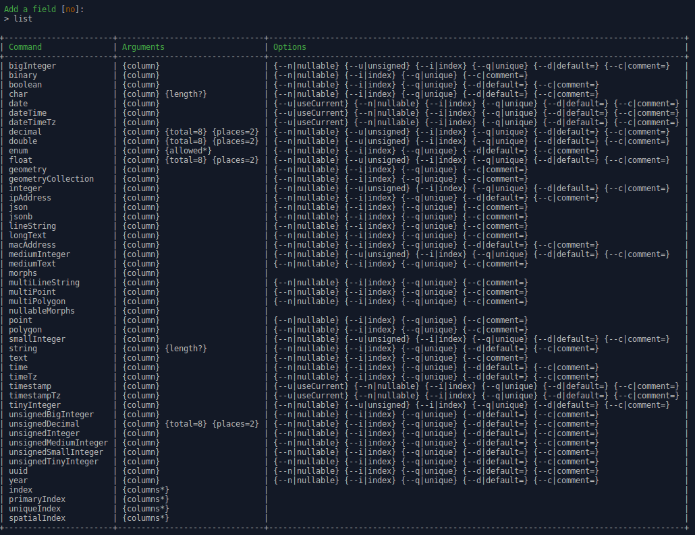

[< Back](../README.md#table-of-content)

# Usage

[Generation process](#generation-process)  
[Defining migration fields](#defining-migration-fields)  
[Layout inheritance](#layout-inheritance)

Each CRUD theme is available as a dedicated command.  
Please call any CRUD command with the `-h` switch to see a complete description of it's arguments and options.

## Generation process

The only mandatory argument for CRUD commands is the FullName of the model.  
Any step of the process can also be set using options, please see [CRUD command options](crud-options.md) for more details.

When invoked, depending on provided options, a wizard will drive you through following steps.

1. **Plurals definition**  
Plurals is automatically suggested based on model's FullName and english language.  
Please pay attention to that important step and correct the proposed value if needed, otherwise simply confirm.
2. **Timestamps definition**  
Choose the option you need, simply confirm to add standart timestamps fields.
3. **SoftDeletes**  
Choose the option you need, simply confirm to add standart softDelete fields.
4. **Migration fields**  
Define your model's table field (see detailed explanations below).
5. **Review and confirm CRUD configuration**  
Review the displayed summary of the CRUD and confirm to start files generation.  

To use your CRUD, simply run `php artisan migrate` and access to the displayed index path.  
You can also create some data for your model using the generated seeder class.

## Defining migration fields

When dealing with CRUDs, a tricky part is often to define model's properties (aka table fields):
fields types and syntax vary a lot, and user input needs to be guided and validated. 

I believe that the Laravel commands signature syntax is very great to do that in a concise and handy way.  
So I've kinda "hacked" it to make that step as easy as possible.

Please note that you can also use that trick for your own needs using the `Bgaze\Crud\Support\SignedInput` class.

**Adding a field:**

To add a field, enter its type followed with required arguments and validate.  
The CRUD wizard provides autocompletion for fields types, use the `TAB` key to expand a proposition.

```
Adding a foo integer field, nullable and indexed:
    Input:  integer foo -n -i
    Result: $table->integer('foo')->nullable()->index();

Adding a bar varchar field, with a length of 100 and a unique constraint:
    Input:  string bar 100 -q
    Result: $table->string('foo', 100)->unique();

Adding a baz enum field, with 'user' and 'admin' as values, and 'user' as default value:
    Input:  enum baz user admin -d user
    Result: $table->enum('baz', ['user', 'admin'])->default('user');

Adding a primary index on firstname and lastname fields:
    Input:  primaryIndex firstname lastname
    Result: $table->primary(['firstname', 'lastname']);
```

**Field type help:**

To get the detailed syntax of a type, validate with no arguments.


**Field types list:**

To see a detailed list of available types, enter `list` and validate.



## Layout inheritance.

> This section is written for **crud:classic** theme, but should also work with any theme creating blade templates.  
> See [Custom CRUD theme](custom-theme.md) for more information on CRUD theme creation.

When a theme creates views, they extend from a provided base layout.  
Obviously, we wish that views extend our application layout.

There is two ways to do that.  
In both cases, the application layout must be compatible with default one.

**Overriding theme's layout**

Publish theme's views :

```
php artisan vendor:publish --tag=crud-classic-views
```

Then customize the created file `/resources/views/vendor/crud-classic/layout.blade.php`.  
It will be automatically used when extending `crud-classic::layout`.

**Extending theme's layout**

As I don't like to have my app layouts in a vendor subfolder, this is my prefered way.  
Simply create a view extending the theme layout:

```
<!-- /resources/views/layouts/main.blade.php -->
@extends('crud-classic::layout')
```

Then use pass it to the CRUD command option:

```
php artisan crud:classic --layout=layouts.main MyModelFullName
```

You can configure your app to use it as default for all commands using layout key in `/config/crud.php`.  
You can always use the `theme` option on command to override that configuration.

```
'layout' => 'layouts.main',
```

